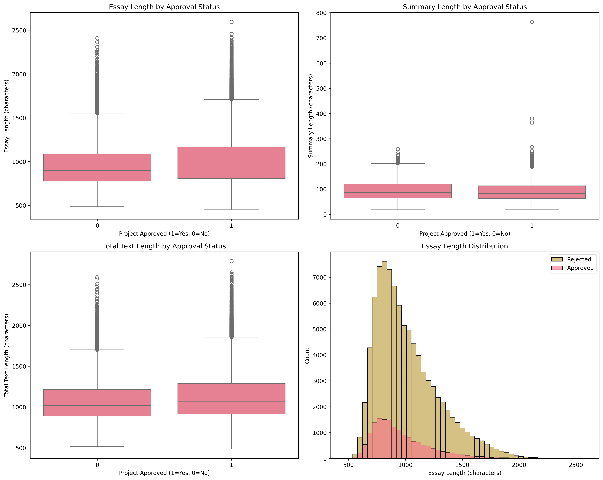
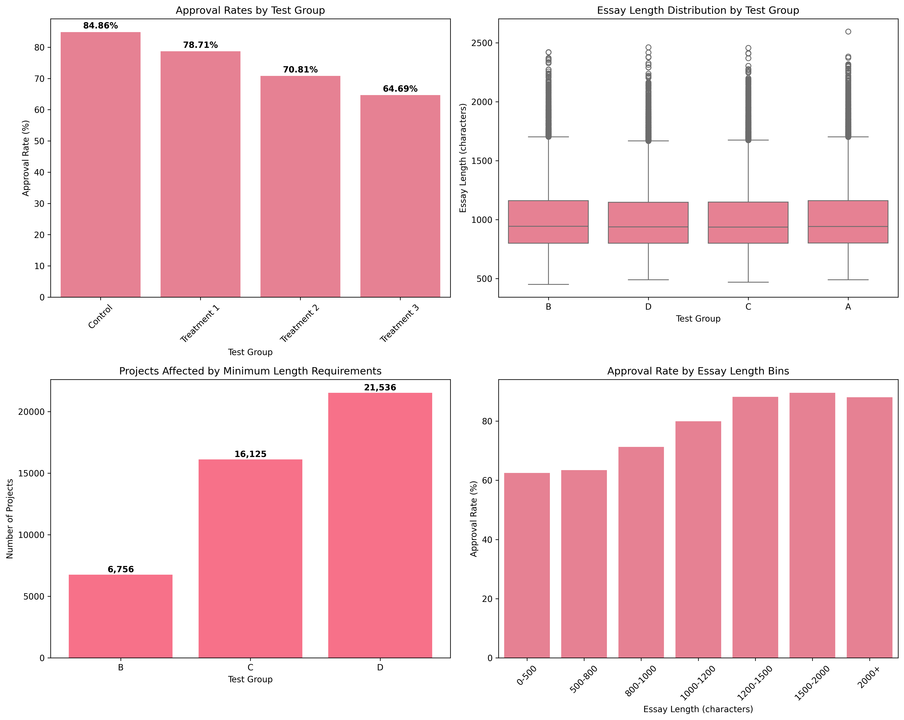

# DonorsChoose Text Length A/B Testing

> Figuring out if making teachers write longer project descriptions actually helps get their projects approved

## What is this project about?

I was looking at DonorsChoose data and noticed something interesting - projects that got approved tended to have longer descriptions than ones that got rejected. Approved projects had essays around 1,015 characters while rejected ones were only about 962 characters.

This got me thinking: **what if we made teachers write longer descriptions? Would that actually help more projects get approved?**

The hypothesis was that requiring longer descriptions would improve overall approval rates. However, the A/B test revealed a more nuanced reality - while longer texts do have higher approval rates, enforcing minimum length requirements actually reduces overall approval rates because it rejects many shorter texts that would have been approved.

## What the project does

This is basically a simulation(since I dont have means of carrying out an actual experiment) to see what would happen if DonorsChoose required teachers to write longer project descriptions. Here's what it does:

1. **Looks at the current data** - 109,248 projects, about 85% get approved
2. **Simulates different scenarios** - what if we required 800, 1000, or 1200 character minimums?
3. **Sees what happens** - do more projects get approved? Do fewer? What's the financial impact?

### Current Data Analysis

The analysis starts by examining the current relationship between text length and project approval:



This visualization shows:
- **Top Left**: Essay length distribution by approval status - approved projects tend to have longer essays
- **Top Right**: Summary length by approval status  
- **Bottom Left**: Total text length by approval status
- **Bottom Right**: Essay length histogram showing the distribution of approved vs rejected projects

## The test groups

- **Group A (Control)**: Keep things how they are now (no minimum length)
- **Group B**: Require at least 800 characters
- **Group C**: Require at least 1000 characters  
- **Group D**: Require at least 1200 characters

## How to run it

```bash
# Install the stuff you need
pip install pandas numpy matplotlib seaborn scipy

# Run the analysis
python text_length_ab_test.py
```

Or if you want to play around with it in a notebook:
```bash
jupyter notebook text_length_ab_test.ipynb
```

## What you'll see

The script will show you:
- Charts comparing approved vs rejected projects by text length
- How each test group performs compared to the control
- Statistical tests to see if the differences are real or just random
- Business Impact

## The results

The results reveal an interesting pattern. While the overall approval rates decrease when we enforce minimum text length requirements, this is primarily because shorter texts (which have lower approval rates) are being rejected. However, when we look at the longer text bins, we see that projects with longer descriptions actually have **higher approval rates**.

**Overall Results:**
- **Control group**: 84.86% approval rate
- **800 character minimum**: 78.71% approval rate (decrease due to rejecting short texts)
- **1000 character minimum**: 70.81% approval rate (further decrease)
- **1200 character minimum**: 64.69% approval rate (significant decrease)

**Key Insight:** The approval rates are falling because we're rejecting more short texts, but the remaining longer texts actually perform better.

### A/B Test Results Visualization



This comprehensive analysis shows:
- **Top Left**: Approval rates by test group - showing the decline in overall approval rates due to rejecting short texts
- **Top Right**: Essay length distribution by test group - showing how the minimum requirements affected text lengths
- **Bottom Left**: Projects affected by minimum length requirements - showing how many projects would be impacted by the new rules
- **Bottom Right**: Approval rate by essay length bins - **this is the key insight**: longer texts (1000+ characters) actually have higher approval rates than shorter ones

## Files in this project

- `text_length_ab_test.py` - The main script that runs everything
- `text_length_ab_test.ipynb` - Same thing but in a Jupyter notebook
- `donors_choose_eda.ipynb` - My original exploration of the data
- `get_data.py` - Script to get the data
- `donors_choose_data.csv` - The dataset